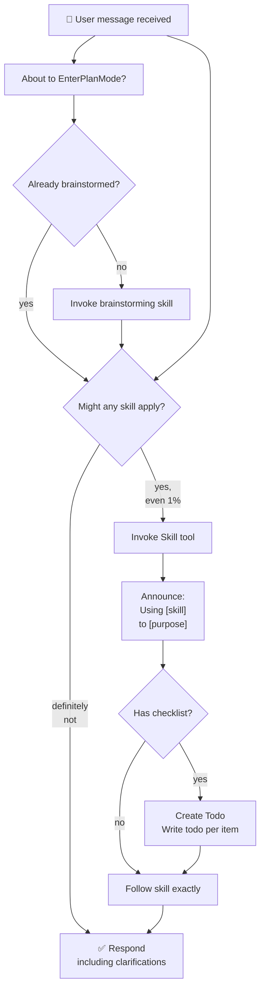

# AI Dev Studio — Future ideas

> This document is NOT part of the Phase 0–6 roadmap in [ARCHITECTURE.md](./ARCHITECTURE.md) — it's a list of features to evaluate and plan once those phases are done. Nothing it describes is implemented yet; these are notes from a design conversation, so the reasoning behind why each point matters isn't lost.

## 0. Making the pipeline production ready

Status: **partially done**, for a single-instance/small-trusted-team deployment target. Full design and task-by-task plan: `docs/superpowers/specs/2026-08-27-production-readiness-design.md` and `docs/superpowers/plans/2026-08-27-production-readiness.md`, implemented on `refactor` (commits `e4f1c29..2feb427`).

- **Error handling**: ✅ addressed for the web layer — a `runDirector()` rejection now marks the feature `blocked` and logs a trace `error` event instead of only reaching the server's console, and the handler that does this can't itself crash the process on a secondary failure. The PM→...→DevOps QA-retry loop predates this work (Phase 6).
- **Security**: ✅ addressed for the stated target — a shared bearer token (`AUTH_TOKEN`) gates every `/api/*` route with a timing-safe comparison, and `isValidFeatureId()` rejects path-traversal input before it reaches a filesystem path. Deliberately **not** addressed: per-user accounts, rate limiting, in-app TLS (a reverse proxy is assumed to sit in front).
- **Scalability**: ❌ explicitly out of scope. The per-feature lock (`FeatureStateStore.acquireLock`/`releaseLock`) and the live-update `EventEmitter` in `trace-logger.ts` both only work within a single process — horizontal scaling would need a distributed lock and a shared pub/sub, neither of which exists. Revisit if the deployment target ever changes from single-instance.
- **Logging and monitoring**: 🟡 minimally addressed — `GET /healthz` plus a `docker-compose.yml` `healthcheck:` block support container orchestration, but there's still no metrics/alerting/dashboards beyond the existing JSONL trace files.
- **Testing**: 🟡 improved but not complete — the suite now covers auth, locking (including a real concurrency regression test for a lock-reclaim race caught in review), featureId validation, and failure-surfacing. Two things remain genuinely unverified: the Docker image has never been built/run end-to-end (no Docker daemon was available while this was implemented), and `src/web/public/app.js`'s token-prompt flow has no automated test (no browser/DOM harness exists in this project).

## 1. Chat interface — web app

Today the only way to use the pipeline is `npm run studio` from the terminal (`scripts/run-studio.ts`), which is just a thin layer over `runDirector()` (`src/agents/director/director.ts`). That function is already decoupled from the CLI — it takes `{featureId, task}` and returns a promise with the final result — so exposing it behind a web backend is, in principle, a matter of not touching the pipeline at all, just adding a new layer on top.

Two possible levels of "live," from lower to higher effort:

- **Simple polling**: an endpoint that reads `features/<featureId>/state.json` (current stage, what's finished, QA retries) and the last lines of `logs/<featureId>.jsonl`, polled periodically by the frontend.
- **Real streaming** (what ARCHITECTURE.md §6 describes as Phase 5): Server-Sent Events or WebSockets, where `TraceLogger.log()` (in `src/observability/trace-logger.ts`) not only writes to the JSONL file but also emits the event to connected clients — a small injected `EventEmitter` would be enough, without changing the event schema that already exists. That way the user sees "PM: ✅ specs ready", "Dev: writing code...", as it happens.

Important not to confuse two different kinds of streaming:

- **Per-stage event streaming** (the above): discrete, one event per `tool_call`/`tool_result`/`agent_start`/`agent_end`.
- **Token-by-token text streaming** within a single agent turn: this already exists at the wrapper level (`src/core/client.ts::streamMessage`, from Phase 0) but no agent uses it yet — they all use `messages.create()` without streaming inside `run-agent-loop.ts`. It could be added for a more granular view ("Dev is thinking...", with text appearing live), but it's a separate layer from per-stage progress streaming.

## 2. Slack integration

Same pattern as the web app, with a different adapter: a Slack app (typically with Bolt for Node) where a slash command or a mention triggers `runDirector()` on the backend. The main difference is that Slack doesn't give you live text streaming like a WebSocket — the way to simulate "live" is by editing a single channel message (`chat.update`) as trace events come in: "PM ✅ → Architect ✅ → Dev ⏳ → ...", instead of sending a new message for every step.

If the streaming layer for the web app is built first (the `EventEmitter` on top of `TraceLogger`), Slack could simply be ANOTHER subscriber of those same events — not a separate integration built from scratch. It's worth designing that layer with more than one consumer in mind from the start.

## 3. Working against a real repository (not a disposable workspace)

Today each feature lives in `workspaces/<featureId>/`, a disposable folder with its own `.git` that the filesystem-git MCP initializes if it doesn't exist (`gitInitIfNeeded` in `src/filesystem-git/git-ops.ts`). Pointing `WORKSPACE_ROOT` at a real, already-existing repo would work as-is — `gitInitIfNeeded` respects an existing `.git` instead of overwriting it — but before actually doing that, three things are needed:

### 3.1 Branch isolation

There's no git tool for creating or switching branches — `src/filesystem-git/git-ops.ts` only has `gitStatus`, `gitAdd`, `gitCommit`, `gitDiff`. Agents work directly on whatever branch is active in `WORKSPACE_ROOT`. Against a real repo, that means a feature that goes wrong could end up committing straight to `main`.

Before using this against a real repo: add a `git_checkout_branch` tool (create-if-missing + switch) to the filesystem-git MCP, and have the Director invoke it automatically when starting a new feature — something like `feature/<featureId>` — before delegating anything to PM.

### 3.2 Finer-grained read/write scope

`fs-ops.ts::resolveSafePath` is today the only barrier: any file inside `WORKSPACE_ROOT` is reachable by Dev (and, since Phase 4, its subagents). In a disposable `workspaces/<featureId>/` that doesn't matter; in a real repo it means an agent could, in principle, touch any file in the repo, not just the ones relevant to the feature.

Ideas to evaluate: a per-feature path allowlist (with PM or the Director declaring beforehand which folders are relevant), or simply a human review step on the diff before DevOps's commit is considered "final" — none of this pushes to a remote today (there's no `git push` anywhere in the project), so the current worst case is extra local commits, not published code.

### 3.3 A real test runner

QA (`src/agents/qa/agent.ts`) reads code and runs `git_diff`, but doesn't execute any real test suite — its verdict (`VERDICT: APPROVED`/`FAILED`) is a reasoned read by the model, not a green/red run. ARCHITECTURE.md §2 and §5 already mention a `test-runner` MCP that was never built (only `filesystem-git` and `feature-state` were made).

Before trusting QA's verdict against a real repo: build that MCP (a tool that runs `npm test` or whatever the right command is inside `WORKSPACE_ROOT` and returns the real result), and have QA's system prompt use it as part of its review instead of relying only on reading code.

## How this fits the roadmap

None of these three points under section 3 is a new roadmap phase — they're safety prerequisites for the day it's decided to use the project against real code, regardless of which roadmap phase we're in. Points 1 and 2 do line up with what ARCHITECTURE.md already calls Phase 5 (chat with streaming) — this document exists so that, in the meantime, the detail of the design decisions (event streaming vs. text streaming, Slack as another subscriber, etc.) that were discussed along the way to that phase isn't lost.

## 4. Other ideas

                    ┌─────────────────────────┐
                    │ User message received   │
                    └────────────┬────────────┘
                                 │
                    ┌────────────▼────────────┐
                    │ About to EnterPlanMode? │
                    └────────────┬────────────┘
                                 │
                         ┌───────▼────────┐
                         │ Already        │
                         │ brainstormed?  │
                         └─┬──────────┬───┘
                      no   │          │   yes
                ┌───────────▼┐   ┌────▼──────────────┐
                │ Invoke     │   │ Might any skill   │
                │ brainstorm │───┤ apply?            │
                │ skill      │   └─┬──────────────┬──┘
                └────────────┘   yes│             │definitely not
                                    │        ┌────▼──────────────────┐
                        ┌───────────▼──┐     │ Respond               │
                        │ Invoke Skill │     │ (including            │
                        │ tool         │     │ clarifications) ✅    │
                        └────────┬─────┘     └───────────────────────┘
                                 │
                        ┌────────▼──────────┐
                        │ Announce: Using   │
                        │ [skill] to [...]  │
                        └────────┬──────────┘
                                 │
                           ┌─────▼──────┐
                           │ Has        │
                           │ checklist? │
                           └┬──────────┬┘
                        yes │          │ no
                    ┌───────▼─┐   ┌────▼──────┐
                    │ Create  │   │ Follow    │
                    │ Todo    ├───┤ skill     │
                    │         │   │ exactly   │
                    └────┬────┘   └────┬──────┘
                         └──────┬──────┘
                                │
                         ┌──────▼────────┐
                         │ Done ✅       │
                         └───────────────┘

